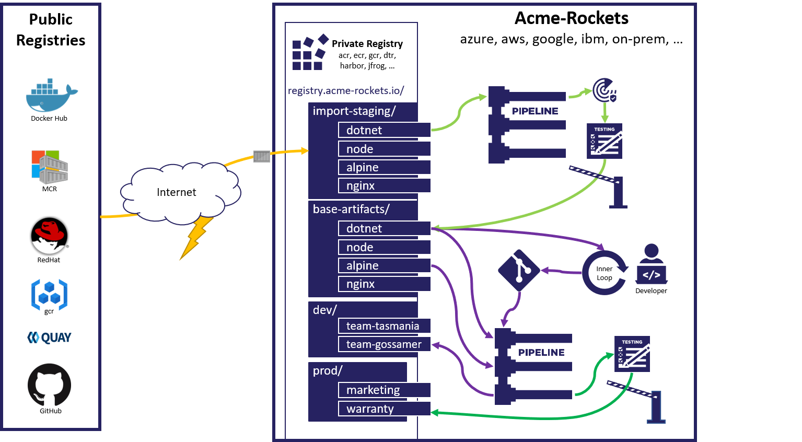

# How to consume & maintain public content with Azure Container Registry Tasks

An Azure container registry hosts your container images and other [OCI artifacts][oci-artifacts] in a private, authenticated environment. However, your environment may have dependencies on public content such as public container images, [helm charts][helm-charts], [OPA][opa] Policies or other artifacts. For example, you might run [nginx] for service routing or `docker build FROM `[alpine][alpine-public-image] by pulling images directly from Docker Hub or another public registry. As upstream changes occur, this article will explain how to import and maintain these public artifacts.

For more information about the risks introduced by dependencies on public content and best practices see the [OCI Consuming Public Content Blog post][oci-consuming-public-content].

This article covers features and workflows in Azure Container Registry to help you manage consuming and maintaining public content:

======

TODO: UPDATE TOC

======

1. Simulate a Public Registry
2. Automate building a hello-world image
3. Automate deploying to an [Azure Container Instance][aci]
4. Simulate upstream changes directly to your environment
5. Create a gated import, that validates upstream changes are appropriate for your environment


* Import local copies of dependent public images.
* Validate public images through security scanning and functional testing.
* Promoting to private registries for internal usage.
* Triggering base image updates for applications dependent upon public content.
* Using [ACR Tasks](container-registry-tasks-overview.md) to automate this workflow.



This article refers mainly to container images, but the concepts apply to other supported [registry artifacts](container-registry-image-formats.md).

The gated import workflow refers to decoupling your organizations dependencies on externally managed artifacts. For instance, images sourced from public registries like: [docker hub][docker-hub], [gcr][gcr], [quay][quay], [github container registry][ghcr], [Microsoft Container Registry][mcr] or even other public [Azure Container Registries][acr].

Consider balancing these two, possibly conflicting goals:

1. Do you really want an unexpected upstream change to possibly take out your production system?
2. Do you want upstream security fixes, for the versions you depend upon, to be automatically deployed?

## Prerequisites

* Create three registries to represent the workflow
  * A simulated copy of docker hub for public images.
    * This allows us simulate a base image update, which would normally be initiated on [Docker Hub][docker-hub] or other public registries.
  * A development team registry, that will host one more more teams that build and manage images.
    * **Note:** [repository based RBAC (preview)][acr-repo-permissions] is now available, enabling multiple teams to share a single registry, with unique permission sets
  * A registry to host imported base artifacts.
* An Azure KeyVault for storing access keys to the registries
* An [Azure Container Instance][aci] to host the `hello-world` image.
  
### Set environment variables

In this section, we'll configure variables unique to your environment. We follow best practices for placing resources with durable content in their own resource group to minimize accidental deletion, however you can place these in a single resource group if desired.

  ```azurecli
  # Set the three registry names:
  REGISTRY_PUBLIC=publicregistry
  REGISTRY_PUBLIC_RG=${REGISTRY_PUBLIC}-rg
  REGISTRY_PUBLIC_URL=${REGISTRY_PUBLIC}.azurecr.io

  REGISTRY_BASE_ARTIFACTS=acmebaseartifacts
  REGISTRY_BASE_ARTIFACTS_RG=${REGISTRY_BASE_ARTIFACTS}-rg
  REGISTRY_BASE_ARTIFACTS_URL=${REGISTRY_BASE_ARTIFACTS}.azurecr.io

  REGISTRY=acmerockets
  REGISTRY_RG=${REGISTRY}-rg
  REGISTRY_URL=${REGISTRY}.azurecr.io

  REGISTRY_DOCKERHUB_URL=docker.io

  RESOURCE_GROUP_LOCATION=eastus

  # Azure KeyVault for storing secrets
  AKV=acr-task-credentials
  AKV_RG=${AKV}-rg

  # ACI for hosting the deployed application
  ACI=hello-world-aci
  ACI_RG=${ACI}-rg
  ```

- GIT repositories and token  
  To simulate your environment, fork each of these into repositories you can mange. Then, update the variables for your forked repositories.
  Notice `:main` concatenated to the end of the git URLs representing the default repository branch.

  ```azurecli
  GIT_BASE_IMAGE_NODE=https://github.com/importing-public-content/base-image-node.git#main
  GIT_NODE_IMPORT=https://github.com/importing-public-content/import-baseimage-node.git#main
  GIT_HELLO_WORLD=https://github.com/importing-public-content/hello-world.git#main
  ```

  Establish a Git Token for ACR Tasks to clone and establish git webhooks.
  See: @DAN, CAN YOU UPDATE TO A REFERENCE FOR REQUIRED PERMISSIONS?

  ```azurecli
  GIT_TOKEN=<set-git-token-here>
  ```

- Docker Hub Credentials  
  To avoid throttling and identify requests, [create a Docker Hub token][docker-hub-tokens]
  REGISTRY_DOCKERHUB_USER=<yourusername>
  REGISTRY_DOCKERHUB_PASSWORD=<yourtoken>


### Create Resources

- Create the three registries:

  ```azurecli
  az group create --name $REGISTRY_PUBLIC_RG --location $RESOURCE_GROUP_LOCATION
  az acr create --resource-group $REGISTRY_PUBLIC_RG --name $REGISTRY_PUBLIC --sku Premium

  az group create --name $REGISTRY_BASE_ARTIFACTS_RG --location $RESOURCE_GROUP_LOCATION
  az acr create --resource-group $REGISTRY_BASE_ARTIFACTS_RG --name $REGISTRY_BASE_ARTIFACTS --sku Premium

  az group create --name $REGISTRY_RG --location $RESOURCE_GROUP_LOCATION
  az acr create --resource-group $REGISTRY_RG --name $REGISTRY --sku Premium
  ```

- Create a KeyVault for secrets

  ```azurecli
  az group create --name $AKV_RG --location $RESOURCE_GROUP_LOCATION
  az keyvault create --resource-group $AKV_RG --name $AKV
  ```

- Create a Docker Hub token  
  To avoid throttling and identify requests, [create a Docker Hub token][docker-hub-tokens]

  ```azurecli
  az keyvault secret set \
  --vault-name $AKV \
  --name registry-dockerhub-user \
  --value $REGISTRY_DOCKERHUB_USER

  az keyvault secret set \
  --vault-name $AKV \
  --name registry-dockerhub-password \
  --value $REGISTRY_DOCKERHUB_PASSWORD
  ```

- Set and Verify a Git token within KeyVault

```azurecli
az keyvault secret set --vault-name $AKV --name github-token --value $GIT_TOKEN
az keyvault secret show --vault-name $AKV --name github-token --query value -o tsv
```

- Create a Resource Group for an Azure Container Instance

  ```azurecli
  az group create --name $ACI_RG --location $RESOURCE_GROUP_LOCATION
  ```

### Create public node base image

To simulate the node image on Docker Hub, create an [ACR Task][acr-task] to build and maintain the public image. This allows simulating changes by the node image maintainers.

```azurecli
az acr task create \
  --name node-public \
  -r $REGISTRY_PUBLIC \
  -f acr-task.yaml \
  --context $GIT_BASE_IMAGE_NODE \
  --git-access-token $(az keyvault secret show \
                        --vault-name $AKV \
                        --name github-token \
                        --query value -o tsv) \
  --set REGISTRY_FROM_URL=${REGISTRY_DOCKERHUB_URL}/ \
  --assign-identity
```

Add credentials for Docker Hub

```azurecli
az acr task credential add \
  -n node-public \
  -r $REGISTRY_PUBLIC \
  --login-server $REGISTRY_DOCKERHUB_URL \
  -u https://${AKV}.vault.azure.net/secrets/registry-dockerhub-user \
  -p https://${AKV}.vault.azure.net/secrets/registry-dockerhub-password \
  --use-identity [system]
```

Grant access to read values from the KeyVault

```azurecli
az keyvault set-policy \
  --name $AKV \
  --resource-group $AKV_RG \
  --object-id $(az acr task show \
                  --name node-public \
                  --registry $REGISTRY_PUBLIC \
                  --query identity.principalId --output tsv) \
  --secret-permissions get
```

Run the task to generate the `node` image

```azurecli
az acr task run -r $REGISTRY_PUBLIC -n node-public
```

List the image in the simulated public registry

```azurecli
az acr repository show-tags -n $REGISTRY_PUBLIC --repository node
```

## Create a Token for access to the "public" registry

Using [ACR Tokens][acr-tokens], create access tokens, scoped to `pull`

```azurecli
az keyvault secret set \
  --vault-name $AKV \
  --name "registry-${REGISTRY_PUBLIC}-user" \
  --value "registry-${REGISTRY_PUBLIC}-user"

az keyvault secret set \
  --vault-name $AKV \
  --name "registry-${REGISTRY_PUBLIC}-password" \
  --value $(az acr token create \
              --name "registry-${REGISTRY_PUBLIC}-user" \
              --registry $REGISTRY_PUBLIC \
              --scope-map _repositories_pull \
              -o tsv \
              --query credentials.passwords[0].value)
```

## Create an ACR Token for access by ACI to pull the image

A token to the registry with `hello-world` is created. Permissions are scoped to read (pull)

```azurecli
az keyvault secret set \
  --vault-name $AKV \
  --name "registry-${REGISTRY}-user" \
  --value "registry-${REGISTRY}-user"

az keyvault secret set \
  --vault-name $AKV \
  --name "registry-${REGISTRY}-password" \
  --value $(az acr token create \
              --name "registry-${REGISTRY}-user" \
              --registry $REGISTRY \
              --repository hello-world content/read \
              -o tsv \
              --query credentials.passwords[0].value)
```

## Create the `hello-world` image from the public registry

As we're simulating a public registry, which could be docker hub, we provide credentials in the form of docker login within the `acr-task.yaml`. Since the registry is an ACR, we use the token created above. However, this same pattern may be used to pass docker credentials to docker hub.

Within the `acr-task.yaml`, we deploy the newly built image to ACI. The resource group was created above. By calling `az container create` with only a difference in the `image:tag`, the same instance is used.

```azurecli
az acr task create \
  -n hello-world \
  -r $REGISTRY \
  -f acr-task.yaml \
  --context $GIT_HELLO_WORLD \
  --git-access-token $(az keyvault secret show \
                        --vault-name $AKV \
                        --name github-token \
                        --query value -o tsv) \
  --set REGISTRY_FROM_URL=${REGISTRY_PUBLIC_URL}/ \
  --set KEYVAULT=$AKV \
  --set ACI=$ACI \
  --set ACI_RG=$ACI_RG \
  --assign-identity
```

Add credentials for our Public Registry

```azurecli
az acr task credential add \
  -n hello-world \
  -r $REGISTRY \
  --login-server $REGISTRY_PUBLIC_URL \
  -u https://${AKV}.vault.azure.net/secrets/registry-${REGISTRY_PUBLIC}-user \
  -p https://${AKV}.vault.azure.net/secrets/registry-${REGISTRY_PUBLIC}-password \
  --use-identity [system]
```

Grant access to read values from the KeyVault

```azurecli
az keyvault set-policy \
  --name $AKV \
  --resource-group $AKV_RG \
  --object-id $(az acr task show \
                  --name hello-world \
                  --registry $REGISTRY \
                  --query identity.principalId --output tsv) \
  --secret-permissions get
```

The task was assigned a system identity, which is given access to the ACI resource group for permissions to create the instance.

```azurecli
az role assignment create \
  --assignee $(az acr task show \
  --name hello-world \
  --registry $REGISTRY \
  --query identity.principalId --output tsv) \
  --scope $(az group show -n $ACI_RG --query id -o tsv) \
  --role owner
```

With the task created, run the task to build/deploy the hello-world image:

```azurecli
az acr task run -r $REGISTRY -n hello-world
watch -n1 az acr task list-runs -r $REGISTRY
```

Once created, browse the site hosting the `hell-world` image.

```bash
explorer.exe "http://"$(az container show \
  --resource-group $ACI_RG \
  --name ${ACI} \
  --query ipAddress.ip \
  --out tsv)
```

## Update the base image with a "bad" change

Open the `Dockerfile` in base-image-node repo
Change the `BACKGROUND_COLOR` to `Red` to simulate a change that would break our environment.

```Dockerfile
ARG REGISTRY_NAME=
FROM ${REGISTRY_NAME}node:15-alpine
ENV NODE_VERSION 15-alpine
ENV BACKGROUND_COLOR Red
```

Commit the change and watch for ACR Tasks to automatically start building.

Watch for the task to start executing:

```azurecli
watch -n1 az acr task list-runs -r $REGISTRY_PUBLIC
```

You should eventually see STATUS `Succeeded` based on a TRIGGER of `Commit`:

```azurecli
RUN ID    TASK      PLATFORM    STATUS     TRIGGER    STARTED               DURATION
--------  --------  ----------  ---------  ---------  --------------------  ----------
ca4       hub-node  linux       Succeeded  Commit     2020-10-24T05:02:29Z  00:00:22
```

Type `CTRL-C` to exit the watch command, then view the logs for the most recent run:

```azurecli
az acr task logs -r $REGISTRY_PUBLIC
```

Once the node image is completed, `watch` for ACR Tasks to automatically start the hello-world image:

```azurecli
watch -n1 az acr task list-runs -r $REGISTRY
```

You should eventually see STATUS `Succeeded` based on a TRIGGER of `Image Update`

```azurecli
RUN ID    TASK         PLATFORM    STATUS     TRIGGER       STARTED               DURATION
--------  -----------  ----------  ---------  ------------  --------------------  ----------
dau       hello-world  linux       Succeeded  Image Update  2020-10-24T05:08:45Z  00:00:31
```

Type `CTRL-C` to exit the watch command, then view the logs for the most recent run:

```azurecli
az acr task logs -r $REGISTRY
```

Once completed, browse the site hosting the updated `hell-world` image, which should have a red (broken) background.

```bash
explorer.exe "http://"$(az container show \
  --resource-group $ACI_RG \
  --name ${ACI} \
  --query ipAddress.ip \
  --out tsv)
```

## Checking in

At this point, you've created a `hello-world` image that is automatically built on git commits, and changes to the base `node` image. While we've built against a base image in ACR, this could be any supported registry.

## Stopping red backgrounds

Automate the importing of the node base image from a public registry to our base artifacts registry. As part of the import, test and stop any red backgrounds from coming through with validation tests

- Build a test image
- Run a functional test script
- Only if the image tests successfuly, import the public image to the base images
- TODO: store an old tag for rollback
- Explain the `test.sh` script, elaborating on how to add more tests

### Write automation testing

To gate any upstream content, automated testing is implemented. In this example, a `test.sh`

- Create an ACR Task to import and test the node base image:

  ```azurecli
    az acr task create \
    --name base-import-node \
    -f acr-task.yaml \
    -r $REGISTRY_BASE_ARTIFACTS \
    --context $GIT_NODE_IMPORT \
    --git-access-token $(az keyvault secret show \
                          --vault-name $AKV \
                          --name github-token \
                          --query value -o tsv) \
    --set REGISTRY_FROM_URL=${REGISTRY_PUBLIC_URL}/ \
    --assign-identity
  ```

Add credentials for our Public Registry

```azurecli
az acr task credential add \
  -n base-import-node \
    -r $REGISTRY_BASE_ARTIFACTS \
  --login-server $REGISTRY_PUBLIC_URL \
  -u https://${AKV}.vault.azure.net/secrets/registry-${REGISTRY_PUBLIC}-user \
  -p https://${AKV}.vault.azure.net/secrets/registry-${REGISTRY_PUBLIC}-password \
  --use-identity [system]
```

Grant access to read values from the KeyVault

```azurecli
az keyvault set-policy \
  --name $AKV \
  --resource-group $AKV_RG \
  --object-id $(az acr task show \
                  --name base-import-node \
                  --registry $REGISTRY_BASE_ARTIFACTS \
                  --query identity.principalId --output tsv) \
  --secret-permissions get
```

```azurecli
az acr task run -n base-import-node -r $REGISTRY_BASE_ARTIFACTS
```
## Troubleshooting

- `./test.sh: Permission denied`
      ```bash
      chmod +x ./test.sh
      ```

Add a `AcrPull` token to access the base-artifacts registry

```azurecli
az keyvault secret set \
  --vault-name $AKV \
  --name "registry-${REGISTRY_BASE_ARTIFACTS}-user" \
  --value "registry-${REGISTRY_BASE_ARTIFACTS}-user"

az keyvault secret set \
  --vault-name $AKV \
  --name "registry-${REGISTRY_BASE_ARTIFACTS}-password" \
  --value $(az acr token create \
              --name "registry-${REGISTRY_BASE_ARTIFACTS}-user" \
              --registry $REGISTRY_BASE_ARTIFACTS \
              --repository node content/read \
              -o tsv \
              --query credentials.passwords[0].value)
```

Update the `hello-world` image to pull from the base artifacts registry

Add credentials for our Public Registry

```azurecli
az acr task credential add \
  -n hello-world \
    -r $REGISTRY \
  --login-server $REGISTRY_BASE_ARTIFACTS_URL \
  -u https://${AKV}.vault.azure.net/secrets/registry-${REGISTRY_BASE_ARTIFACTS}-user \
  -p https://${AKV}.vault.azure.net/secrets/registry-${REGISTRY_BASE_ARTIFACTS}-password \
  --use-identity [system]
```

Change the REGISTRY_FROM_URL to use the BASE_ARTIFACTS registry

```azurecli
az acr task update \
  -n hello-world \
  -r $REGISTRY \
  --set REGISTRY_FROM_URL=${REGISTRY_BASE_ARTIFACTS_URL}/ \
  --set ACI=$ACI \
  --set ACI_RG=$ACI_RG

az acr task run -r $REGISTRY -n hello-world
```

#TODO: Log bug on updating existing SET variables clears out previous values

Monitor base image updates

``azurecli
$REGISTRY=acmerockets

watch -n1 az acr task list-runs -r $REGISTRY_PUBLIC
az acr task logs -r $REGISTRY_PUBLIC

watch -n1 az acr task list-runs -r $REGISTRY_BASE_ARTIFACTS
az acr task logs -r $REGISTRY_BASE_ARTIFACTS

watch -n1 az acr task list-runs -r $REGISTRY
az acr task logs -r $REGISTRY
```

## Cleaning up

```azurecli
az group delete -n $REGISTRY_RG -y
az group delete -n $REGISTRY_PUBLIC_RG -y
az group delete -n $REGISTRY_BASE_ARTIFACTS_RG -y
az group delete -n $AKV_RG -y
az group delete -n $ACI_RG -y
```

========
STOPPING POINT
========

## Image import

Use [image import](container-registry-import-images.md) in your workflows to import Docker images from public registries easily to your Azure container registries. The [az acr import](/cli/azure/acr)
Basic, manual feature to move/import base images to ACR from multiple public clouds  (other ACR, DH, GCR, quay, etc.)

Import to (or georeplicate to) same region where you'll deploy - "bring the content to the region"

## Maintain base images in separate registry(ies)

"Regardless of the size of the company, you'll likely want to have a separate registry for managing base images. While it's possible to share a registry with multiple development teams, it's difficult to know how each team may work, possibly requiring VNet features, or other registry specific capabilities.

Depending on your workflow, you may want two registries for base images, one for staging and validating base images, and one for storing verified base images ready for use by your dev teams.

Decouple management of base images from consumption by dev teams.

## Adopt tagging scheme for base image updates

See container-registry-image-tag-version.md

* Build images from stable service tags - can continue to receive security patches and framework updates.

## Protect images using Image/tag locking

Support your build and deployment workflows from unintentional image updates.

https://docs.microsoft.com/en-us/azure/container-registry/container-registry-image-lock

* Lock repo from new content
* Block pulls or deletes

## Automate base image updates

Expanding on basic image import, they should create a process by which they import the base images they depend upon into their corporate registry.

1. Automate base image updates by buffering to a staging registry, tests are run as part of the build process. If the tests succeed, the mirrored image is imported to a base-images repository. Use ACR tasks to automate base artifact validation:

* Pull to staging registry - build both "mirrored" image and "test" image, including test/validation scripts
* Scan [build image to run a vulnerability scanner such as Aqua]
* Test [build image to run a test script]
* If validated, move to base images reg repo

NEED --> Example multistep task to accomplish this? something like
https://github.com/Azure-Samples/acr-tasks/blob/master/build-test-update-hello-world.yaml or https://github.com/SteveLasker/Presentations/tree/master/demo-scripts/buffering-building-patching

## Trigger downstream app image builds based on base image update

Using ACR Tasks, tracking base image updates in the base reg repo:

Concepts: container-registry-tasks-base-images.md

Walkthroughs: https://docs.microsoft.com/en-us/azure/container-registry/container-registry-tutorial-base-image-update (base in same reg)
https://docs.microsoft.com/en-us/azure/container-registry/container-registry-tutorial-private-base-image-update (base in separate reg)

## Next steps

See Sample E2E scenario

https://github.com/SteveLasker/Presentations/tree/master/demo-scripts/buffering-building-patching

========

 and your might host copies of certain public images for your organization's deployments.

Dependencies on public content can introduce numerous risks to your organization
 
[Intro] Main message is: Use ACR to keep local copies of all artifacts that organization depends on for development and deployments.
 
Example: Companies should never base their FROM statements on external registries
 
Should mitigate Docker TOS changes but also a best practice


## Extra Snippets

**NOTE:** _Many variables are out of sync_

az acr task run -n base-import-node -r $REGISTRY_BASE_ARTIFACTS
az acr task list-runs -r $REGISTRY_BASE_ARTIFACTS

az role assignment create \
  --assignee $PRINCIPAL_ID \
  --scope $(az acr show --name $REGISTRY_BASE_ARTIFACTS --query id --output tsv) \
  --role AcrPull

az acr task credential add \
  --name hello-world \
  --registry $REGISTRY \
  --login-server $REGISTRY_BASE_ARTIFACTS_URL \
  --use-identity [system]
```

```azurecli
az role assignment create \
  --assignee $PRINCIPAL_ID \
  --scope $(az acr show --name ${REGISTRY_BASE_ARTIFACTS} \
              --query id --output tsv) \
  --role AcrPull
```

Create the ACI

```azurecli
az group create --name $ACI_RG --location $RESOURCE_GROUP_LOCATION

az container create \
  --resource-group $ACI_RG \
  --name ${ACI} \
  --image ${REGISTRY_URL}/hello-world:$HELLO_WORLD_TAG \
  --registry-username $(az keyvault secret show \
                        --vault-name $AKV \
                        --name ${REGISTRY}-user \
                        --query value -o tsv) \
  --registry-password $(az keyvault secret show \
                        --vault-name $AKV \
                        --name ${REGISTRY}-password \
                        --query value -o tsv) \
  --ip-address=public \
  --ports 80 \
  -o jsonc
```

```azurecli
az acr task create \
  -n hello-world \
  -r $REGISTRY \
  -t hello-world:{{.Run.ID}} \
  -f acr-task-build.yaml \
  --set REGISTRY_URL=${REGISTRY_PUBLIC_URL}/ \
  --set-secret REGISTRY_PUBLIC_USER=$(az keyvault secret show \
      --vault-name $AKV \
      --name "registry-${REGISTRY_PUBLIC}-user" \
      --query value -o tsv) \
  --set-secret REGISTRY_PUBLIC_PASSWORD=$(az keyvault secret show \
      --vault-name $AKV \
      --name registry-${REGISTRY_PUBLIC}-password \
      --query value -o tsv) \
  --context $GIT_HELLO_WORLD \
  --git-access-token $(az keyvault secret show \
                        --vault-name $AKV \
                        --name github-token \
                        --query value -o tsv) \
  --assign-identity
```

## Create an ACI Instance

Retrieve the latest tag for the hello-world image
```azurecli
HELLO_WORLD_TAG=$(az acr task list-runs \
  -r $REGISTRY \
  -n hello-world \
  -o tsv --query [0].name)
```

## Import the public image into the base artifacts registry

```azurecli
az acr import \
  --name $REGISTRY_BASE_ARTIFACTS \
  --source ${REGISTRY_PUBLIC_URL}/15-alpine \
  --image node:15-alpine \
  --username $(az keyvault secret show \
                --vault-name $AKV \
                --name "registry-${REGISTRY_PUBLIC}-user" \
                --query value -o tsv) \
  --password $(az keyvault secret show \
                --vault-name $AKV \
                --name "registry-${REGISTRY_PUBLIC}-password" \
                --query value -o tsv) \
  --force
  
  az acr task create \
  --name base-import \
  -f acr-task.yaml \
  -r $REGISTRY_BASE_ARTIFACTS \
  --context $GIT_BASE_IMAGE_NODE \
  --git-access-token $(az keyvault secret show \
                        --vault-name $AKV \
                        --name github-token \
                        --query value -o tsv)
```

## Manually import the updated base image

```azurecli
az acr import \
  --name $REGISTRY_BASE_ARTIFACTS \
  --source ${REGISTRY_PUBLIC_URL}/node:15-alpine \
  --image node:15-alpine \
  --username $(az keyvault secret show \
                --vault-name $AKV \
                --name public-registry-user \
                --query value -o tsv) \
  --password $(az keyvault secret show \
                --vault-name $AKV \
                --name public-registry-password \
                --query value -o tsv) \
  --force
```

## Manually update the ACI instance

```azurecli
HELLO_WORLD_TAG=dau
az container create \
  --resource-group $ACI_RG \
  --name ${ACI} \
  --image ${REGISTRY_URL}/hello-world:$HELLO_WORLD_TAG \
  --registry-username=$(az keyvault secret show \
                        --vault-name $AKV \
                        --name "aci-pull-user" \
                        --query value -o tsv) \
  --registry-password=$(az keyvault secret show \
                        --vault-name $AKV \
                        --name "aci-pull-password" \
                        --query value -o tsv) \
  --ip-address=public \
  --ports 80
```
## Notes

### Go Templating Issue

"-" is allowed in key name, but you can not get the value through "dot" syntax like "Values.my-name"
use `index .Values.foo-bar when -'s are in the name


[acr]:                          https://aka.ms/acr
[acr-repo-permissions]:         https://aka.ms/acr/repo-permissions
[acr-task]:                     https://aka.ms/acr/tasks
[acr-tokens]:                   https://aka.ms/acr/tokens
[aci]:                          https://aka.ms/aci
[alpine-public-image]:          https://hub.docker.com/_/alpine
[docker-hub]:                   https://hub.docker.com
[docker-hub-tokens]:            https://hub.docker.com/settings/security
[gcr]:                          https://cloud.google.com/container-registry
[ghcr]:                         https://docs.github.com/en/free-pro-team@latest/packages/getting-started-with-github-container-registry/about-github-container-registry
[helm-charts]:                  https://helm.sh
[mcr]:                          https://aka.ms/mcr
[nginx-public-image]:           https://hub.docker.com/_/nginx
[oci-artifacts]:                https://aka.ms/acr/artifacts
[oci-consuming-public-content]: https://docs.google.com/document/d/1fxayMznIkszBI9Y2S3KGSyi2hFMwUIwDfn3D2wQcye4/edit?usp=sharing
[quay]:                         https://quay.io
